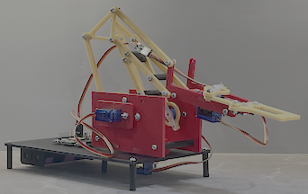
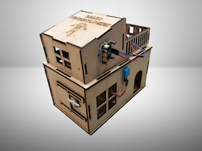
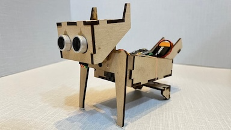
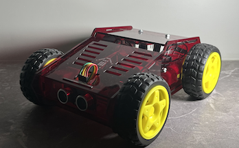
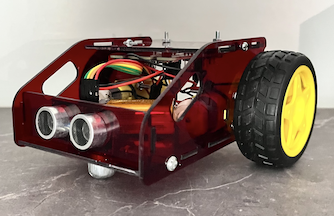

New Silikon Electronics
===========================================

---

## Support for Projects

- [Robotic Arm - 4DOF](#robotic-arm---4dof)
- [Smart Home - IoT](#smart-home---iot)
- [Dogo - Smart Dog](#dogo---smart-dog)
- [Scout 4WD - Smart Car](#scout-4-wheel-drive---a-smartcar)
- [Scout 2WD - Smart Car](#scout-2-wheel-drive---a-smartcar)

---

### Robotic Arm - 4DOF

 

All Robotic Arm associated FW can be found in the following directory [Robotic Arm Firmware](https://github.com/iotgupta/new_silikon_electronics/tree/master/projects/robotic%20arm/robotic%20arm%204DOF)

---

### Smart Home - IoT

 

All Smart Home associated FW can be found in the following directory [Smart Home Firmware](https://github.com/iotgupta/new_silikon_electronics/tree/master/projects/smart%20home)

---

### Dogo - Smart Dog

 

All Dogo associated FW can be found in the following directory [Dogo Firmware](https://github.com/iotgupta/new_silikon_electronics/tree/master/projects/smart_dog)

---

### Scout 4 Wheel Drive - A SmartCar

All Scout associated FW can be found in the following directory [Scout 4WD Firmware](https://github.com/iotgupta/new_silikon_electronics/tree/master/projects/smart%20car/scout_4wd)

---

### Scout 2 Wheel Drive - A SmartCar

All Scout associated FW can be found in the following directory [Scout 2WD Firmware](https://github.com/iotgupta/new_silikon_electronics/tree/master/projects/smart%20car/scout_2wd)

---

